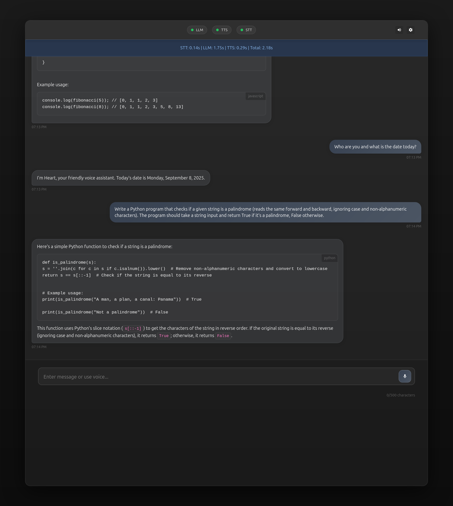
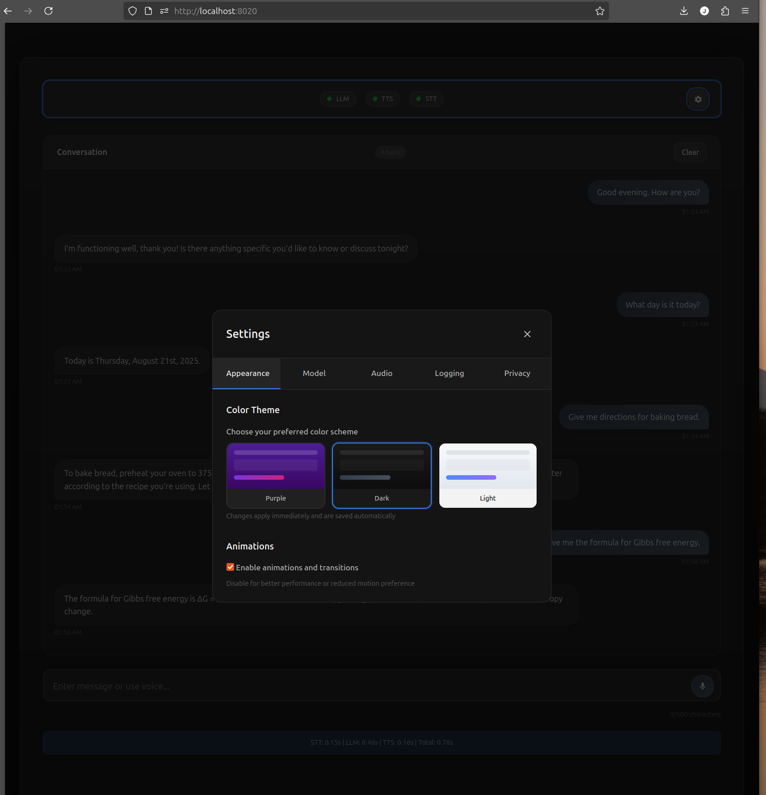

# Voice Flow 🎤✨

> A sophisticated voice-enabled AI assistant with **streamlined UI**, enterprise-grade analytics, privacy controls, and multi-model support.

[](https://opensource.org/licenses/MIT)
[](https://developer.mozilla.org/en-US/docs/Web/JavaScript)
[](http://makeapullrequest.com)

## ✨ What Makes Voice Flow Special

Voice Flow is a **production-ready AI assistant** that seamlessly combines voice and text interaction with enterprise-level features you won't find elsewhere:

- 🎯 **Intelligent Conversation Management** - Smart memory pruning keeps conversations flowing naturally
- 📊 **Advanced Analytics Dashboard** - Deep insights into usage patterns and performance metrics  
- 🔒 **Privacy-First Architecture** - GDPR-compliant logging with user consent and data sanitization
- 🎨 **Professional UI/UX** - Responsive design with smooth animations and accessibility features
- ⚡ **Real-time Performance Monitoring** - Live metrics for STT, LLM, and TTS processing
- 🛡️ **Enterprise-Grade Error Handling** - Automatic retry, graceful degradation, and smart recovery
- 🔐 **HTTPS Support** - Full HTTPS compatibility for secure deployments and mobile browser support

## 🆕 What's New in v1.2.0

- **🎨 Completely Redesigned Interface** - Streamlined layout with improved user flow and visual consistency
- **🎯 Enhanced Status Management** - Smart timeout-based notifications with unified display area
- **🎙️ Redesigned Microphone Controls** - Icon-only design with improved cross-browser positioning
- **🧩 Modular CSS Architecture** - Professional code organization for better maintainability
- **📊 Robust Analytics System** - Enhanced error handling and accurate usage tracking
- **🔧 Improved Stability** - Resolved database issues and optimized performance across all browsers
- **📱 Better Mobile Experience** - Enhanced responsive design and touch interaction

## 📸 Screenshots

### Main Interface

*Clean, modern chat interface with streamlined layout and enhanced status management*

### Comprehensive Settings System

#### Model Configuration

*Dynamic model selection with automatic detection of installed Ollama models and parameter tuning*

#### Audio & Voice Settings  

*Professional audio controls with 14 voice options, speech rate adjustment, and volume controls*

#### Appearance & Themes

*Multiple theme options with smooth transitions and enhanced consistency*

#### Logging & Analytics

*Enterprise-grade logging with privacy controls, data export, and improved analytics*

---

## 🚀 Quick Start

### 📝 Upgrading from v1.1.0

Existing users will automatically benefit from all v1.2.0 improvements with no migration required. All settings and conversation history are preserved.

### Prerequisites

You'll need these services running:

1. **[Ollama](https://ollama.ai/)** - Local LLM service (required)
2. **[Kokoro TTS](https://github.com/remsky/Kokoro-FastAPI)** - Text-to-speech (optional)
3. **[Whisper STT](https://github.com/ahmetoner/whisper-asr-webservice)** - Speech-to-text (optional)

### Installation

#### Option 1: HTTP Mode (Development)

Perfect for local development and testing.

```bash
# Clone the repository
git clone https://github.com/johnriggs1959/voice-flow.git
cd voice-flow

# Start Voice Flow
python3 -m http.server 8020

# Open your browser
# http://localhost:8020
```

#### Option 2: HTTPS Mode (Production/Mobile)

Required for mobile browsers and production deployments.

```bash
# 1. Setup Nginx (see HTTPS Setup section below)
# 2. Start Voice Flow via Nginx
# 3. Open your browser
# https://localhost
```

The app automatically detects your protocol and configures itself accordingly!

## 🎯 Key Features

### 🤖 AI Integration

* **Multi-Model Support** - Automatically detects all installed Ollama models
* **Dynamic Model Switching** - Change models without restarting
* **Intelligent Responses** - Voice-optimized AI responses with natural speech formatting
* **Smart Context Management** - Maintains conversation context with memory optimization
* **HTTPS Configuration** - Dynamic service URL configuration for both HTTP and HTTPS modes

### 🎙️ Voice & Audio

* **High-Quality Speech Recognition** - Powered by OpenAI Whisper
* **Natural Text-to-Speech** - 14 voice options (American & British English)
* **Hands-Free Operation** - Voice → Transcription → AI Response → Speech
* **Professional Audio Controls** - Play, pause, download generated speech
* **Mobile Browser Support** - Full voice functionality on mobile via HTTPS

### 📊 Analytics & Monitoring

* **Real-Time Performance Metrics** - Track STT, LLM, and TTS processing times
* **Usage Pattern Analysis** - Peak hours, preferred models, conversation insights
* **Service Health Monitoring** - Live status indicators for all connected services
* **Export Capabilities** - Download logs in JSON, CSV, or Markdown format
* **Enhanced Accuracy** - Improved input method tracking and data validation

### 🔒 Privacy & Security

* **User Consent Management** - GDPR-compliant privacy controls
* **Data Sanitization** - Automatic filtering of sensitive information
* **Local-First Architecture** - Your data stays on your devices
* **Configurable Retention** - Automatic cleanup of old conversation logs
* **HTTPS Support** - Secure communication for production deployments

### 🎨 User Experience

* **Streamlined Interface** - Redesigned layout with Header → Status → Chat → Input flow
* **Responsive Design** - Works beautifully on desktop, tablet, and mobile
* **Enhanced Microphone Controls** - Icon-only design with visual state feedback
* **Unified Status Display** - Single area for all notifications and performance metrics
* **Theme System** - Light, dark, and custom themes with improved consistency
* **Accessibility First** - Screen reader support, keyboard navigation, WCAG compliant
* **Touch-Friendly** - Optimized mobile voice interaction with better button positioning
* **Configuration Manager** - Easy setup for HTTP and HTTPS modes

## 📖 Setup Guide

### 1. Ollama Setup (Required)

```bash
# Install Ollama
curl -fsSL https://ollama.ai/install.sh | sh

# Pull some models
ollama pull llama3.2:3b      # Fast, balanced (recommended)
ollama pull llama3.1:8b      # Higher quality
ollama pull tinyllama:1.1b   # Ultra-fast

# Configure for network access
export OLLAMA_HOST=0.0.0.0:11434
export OLLAMA_ORIGINS=*

# Or configure systemd service
sudo systemctl edit ollama
```

Add this configuration:
```ini
[Service]
Environment="OLLAMA_HOST=0.0.0.0:11434"
Environment="OLLAMA_ORIGINS=*"
```

```bash
# Restart service
sudo systemctl restart ollama
```

### 2. Kokoro TTS Setup (Optional)

```bash
# Clone and start TTS service
git clone https://github.com/remsky/Kokoro-FastAPI.git
cd Kokoro-FastAPI
docker-compose up -d

#OR
docker run -p 8880:8880 ghcr.io/remsky/kokoro-fastapi-cpu:v0.1.4 # CPU, or:
docker run --gpus all -p 8880:8880 ghcr.io/remsky/kokoro-fastapi-gpu:v0.1.4 #NVIDIA GPU
```

### 3. Whisper STT Setup (Optional)

```bash
# Start Whisper service
docker run -d \
  --name whisper-api \
  -p 8000:8000 \
  -e ASR_MODEL=base \
  onerahmet/openai-whisper-asr-webservice:latest
```

## 🔐 HTTPS Setup (For Production/Mobile)

### Step 1: Install Nginx

```bash
# Ubuntu/Debian
sudo apt install nginx

# macOS
brew install nginx
```

### Step 2: Generate SSL Certificate

```bash
# Self-signed certificate (for testing)
sudo openssl req -x509 -nodes -days 365 -newkey rsa:2048 \
  -keyout /etc/ssl/private/localhost.key \
  -out /etc/ssl/certs/localhost.crt \
  -subj "/CN=localhost"

# For production, use Let's Encrypt
sudo apt install certbot python3-certbot-nginx
sudo certbot --nginx -d yourdomain.com
```

### Step 3: Configure Nginx

Create `/etc/nginx/sites-available/voice-flow`:

```nginx
server {
    listen 443 ssl http2;
    server_name localhost;
    
    ssl_certificate /etc/ssl/certs/localhost.crt;
    ssl_certificate_key /etc/ssl/private/localhost.key;
    
    # Voice Flow app files
    root /var/www/voice-flow;
    index index.html;
    
    location / {
        try_files $uri $uri/ /index.html;
    }
    
    # Proxy to Ollama
    location /ollama/ {
        proxy_pass http://localhost:11434/;
        proxy_http_version 1.1;
        proxy_set_header Host $host;
        proxy_buffering off;
        add_header Access-Control-Allow-Origin *;
    }
    
    # Proxy to TTS
    location /tts/ {
        proxy_pass http://localhost:8880/;
        proxy_http_version 1.1;
        proxy_set_header Host $host;
        proxy_buffering off;
        add_header Access-Control-Allow-Origin *;
    }
    
    # Proxy to STT
    location /stt/ {
        proxy_pass http://localhost:8000/;
        proxy_http_version 1.1;
        proxy_set_header Host $host;
        proxy_buffering off;
        client_max_body_size 10M;
        add_header Access-Control-Allow-Origin *;
    }
}
```

### Step 4: Setup Voice Flow for Nginx

```bash
# Copy Voice Flow to Nginx directory
sudo cp -r /path/to/voice-flow /var/www/
sudo chown -R www-data:www-data /var/www/voice-flow

# Or use a symbolic link for development
sudo ln -s /path/to/voice-flow /var/www/voice-flow
chmod 755 ~/voice-flow-directory
sudo usermod -a -G $USER www-data
```

### Step 5: Enable and Start

```bash
# Enable the site
sudo ln -s /etc/nginx/sites-available/voice-flow /etc/nginx/sites-enabled/

# Test configuration
sudo nginx -t

# Restart Nginx
sudo systemctl restart nginx
```

## 🔧 Configuration

### Using the Configuration Manager

1. Open `config.html` in your browser
2. The app auto-detects HTTP or HTTPS mode
3. Test each service connection
4. Save configuration

The configuration automatically adjusts based on your protocol:

- **HTTP Mode:**
  - Ollama: `http://localhost:11434`
  - TTS: `http://localhost:8880`
  - STT: `http://localhost:8000`

- **HTTPS Mode (via Nginx):**
  - Ollama: `https://localhost/ollama`
  - TTS: `https://localhost/tts`
  - STT: `https://localhost/stt`

## 🎵 Usage Examples

### Voice Interaction
1. Click the microphone button
2. Ask your question naturally
3. Watch as it transcribes, processes, and responds with voice

### Model Selection
* **tinyllama:1.1b** - Lightning fast for simple questions
* **llama3.2:3b** - Perfect balance of speed and quality
* **llama3.1:8b** - Detailed, thoughtful responses
* **Custom models** - Add any Ollama-compatible model

### Mobile Access
For mobile browsers, HTTPS is required:
1. Setup HTTPS with Nginx (see above)
2. Find your computer's IP: `ip addr | grep inet`
3. Access from mobile: `https://your-ip-address`

## 🏗️ Architecture

Voice Flow is built with a modular, enterprise-grade architecture:

```
┌─────────────────┐  ┌─────────────────┐  ┌─────────────────┐
│   UI Layer      │  │  Service Layer  │  │  Data Layer     │
├─────────────────┤  ├─────────────────┤  ├─────────────────┤
│ • Chat Interface│  │ • API Service   │  │ • Conversation  │
│ • Settings      │  │ • Audio Service │  │ • Analytics     │
│ • Themes        │  │ • Model Mgmt    │  │ • Logging       │
│ • Status        │  │ • Error Handling│  │ • Privacy       │
└─────────────────┘  └─────────────────┘  └─────────────────┘
```

### Design Principles
* **Memory Efficient** - Smart conversation pruning prevents memory leaks
* **Error Resilient** - Comprehensive error handling with automatic recovery
* **Privacy Conscious** - User consent and data protection built-in
* **Performance Focused** - Real-time monitoring and optimization
* **Protocol Agnostic** - Automatic configuration for HTTP/HTTPS

## 🔧 Technical Improvements (v1.2.0)

### Stability Enhancements
* **Database Reliability** - Resolved IndexedDB transaction failures and connection issues
* **Error Recovery** - Automatic reconnection with exponential backoff retry logic
* **Memory Management** - Enhanced resource cleanup and buffer management
* **Cross-Browser Compatibility** - Improved consistency across Firefox, Chrome, and Safari

### Code Architecture
* **Modular CSS** - Organized stylesheet system (12 focused files vs single monolithic file)
* **Enhanced Analytics** - Robust input detection and comprehensive error handling
* **Performance Optimization** - Reduced console noise and improved caching
* **Developer Experience** - Better code organization for easier maintenance and collaboration

## 📊 Performance

* **Response Time** < 3s average (STT + LLM + TTS)
* **Memory Usage** < 50MB with enhanced automatic pruning
* **Error Rate** < 1% with improved automatic retry and recovery
* **Database Stability** 99%+ uptime with automatic reconnection
* **Accessibility** WCAG 2.1 AA compliant
* **Browser Support** All modern browsers with enhanced cross-platform consistency

## 🐛 Troubleshooting

### Service Connection Issues

```bash
# Check if Ollama is running
curl http://localhost:11434/api/tags

# Check TTS service
curl http://localhost:8880/v1/test

# Check STT service
curl http://localhost:8000/v1/test

# For HTTPS, test through Nginx
curl -k https://localhost/ollama/api/tags
curl -k https://localhost/tts/v1/test
curl -k https://localhost/stt/v1/test
```

### Database Connection Issues
```bash
# If you see IndexedDB transaction errors
# Clear browser data for the application domain
# Or use the built-in "Clear All Data" function in settings

# Check browser console for connection status
# Voice Flow now automatically reconnects dropped connections
```

### Interface Issues
* **Status messages not appearing**: Check if JavaScript is enabled
* **Microphone button positioning**: Clear browser cache and reload
* **Theme inconsistencies**: Use the theme selector in settings to refresh

### HTTPS Certificate Issues
* **Browser shows "Not Secure"**: Normal for self-signed certificates. Click "Advanced" → "Proceed"
* **For production**: Use Let's Encrypt for trusted certificates

### Voice Input Issues
* **On mobile**: Ensure you're using HTTPS (required for getUserMedia API)
* Check browser microphone permissions
* Verify microphone is working in other apps

### Nginx Permission Issues
```bash
# If you see permission denied errors
sudo chown -R www-data:www-data /var/www/voice-flow
# Or use symbolic link method (see HTTPS Setup)
```

## 🛣️ Roadmap

### 🎯 Phase 1: Advanced Features (Next)
* Voice command navigation and shortcuts
* Advanced conversation search and filtering
* Custom wake words and voice commands
* Enhanced model management interface

### 📊 Phase 2: Intelligence & Insights
* Predictive analytics dashboard
* AI-powered usage insights and recommendations
* Performance optimization suggestions
* Smart conversation summarization and search

### 🏢 Phase 3: Enterprise & Collaboration
* Multi-user support with individual profiles
* API integrations and webhook support
* Plugin system for extensibility
* Advanced security and compliance features

## 🤝 Contributing

We love contributions! Here's how to get started:

1. Fork the repository
2. Create a feature branch: `git checkout -b feature/amazing-feature`
3. Make your changes and test thoroughly
4. Commit with clear messages: `git commit -m 'Add amazing feature'`
5. Push to your branch: `git push origin feature/amazing-feature`
6. Open a Pull Request

### Development Setup

```bash
# Fork and clone your fork
git clone https://github.com/yourusername/voice-flow.git
cd voice-flow

# For HTTP development
python3 -m http.server 8020

# For HTTPS testing
# Follow the HTTPS Setup section above
```

## 📄 License

This project is licensed under the MIT License - see the [LICENSE](LICENSE) file for details.

## 🙏 Acknowledgments

* [Ollama](https://ollama.ai/) for excellent local LLM runtime
* [Kokoro TTS](https://github.com/remsky/Kokoro-FastAPI) for high-quality speech synthesis
* [OpenAI Whisper](https://github.com/openai/whisper) for speech recognition
* The open-source AI community for inspiration and tools

## 📞 Support

* 📚 [Documentation](https://github.com/johnriggs1959/voice-flow/wiki) (coming soon)
* 🐛 [Issue Tracker](https://github.com/johnriggs1959/voice-flow/issues)
* 💬 [Discussions](https://github.com/johnriggs1959/voice-flow/discussions)

---

⭐ **Star this repository if it helped you!** ⭐

Made with ❤️ by [John Riggs](https://github.com/johnriggs1959)
